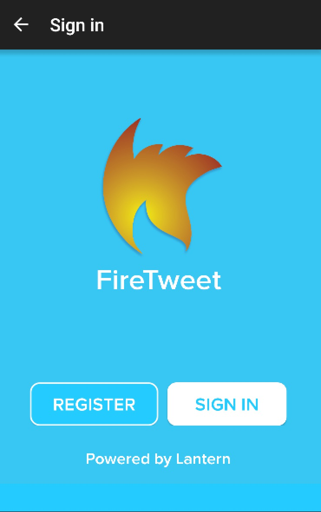
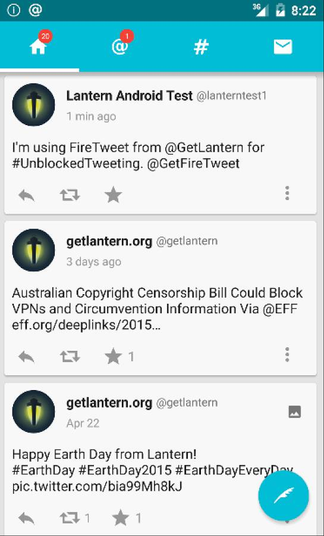

# FireTweet
FireTweet is a Twitter client for Android that uses Lantern to unblock access to Twitter in censored regions around the world.

  
  

[FireTweet](https://github.com/getlantern/firetweet) is an open-source Twitter client for Android. You can download the latest [here](https://github.com/firetweet/downloads/blob/master/firetweet.apk?raw=true).
